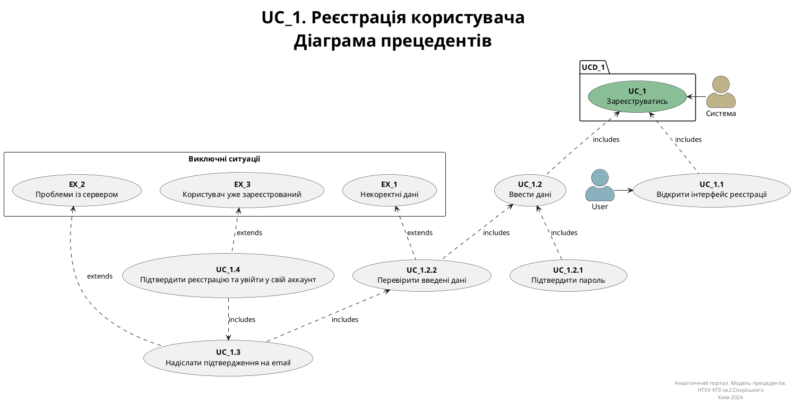
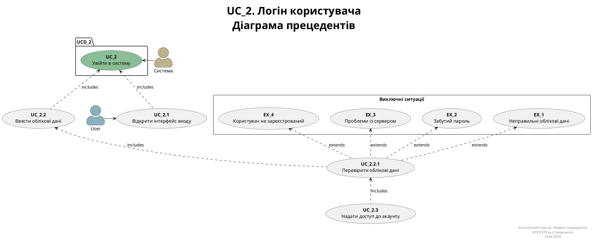
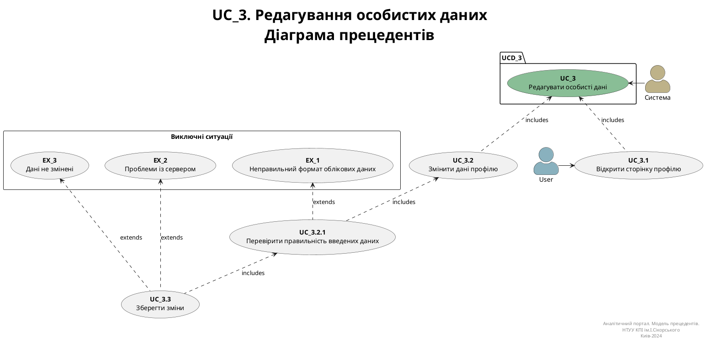

# Розроблення функціональних вимог до системи

## Модель прецедентів

В цьому файлі необхідно перелічити всі документи, розроблені в проекті та дати посилання на них.

_Модель прецедентів повинна містити загальні оглядові діаграми та специфікації прецедентів._

Вбудовування зображень діаграм здійснюється з використанням сервісу [plantuml.com](https://plantuml.com/).

### Use case 1. registerUser - реєстрація користувача

Користувач заходить в систему вперше, але для того, щоб отримати доступ до інтерфейсу програми їм необхідно зареєструватись.  
Основні кроки:

- User відкриває інтерфейс реєстрації
- Вводить необхідну інформацію (ім'я, прізвище, email, пароль)
- Підтверджує пароль за допомогою повторного вводу
- Натискає кнопку реєстрації
- Отримує лист про успішну реєстрацію на пошті та можливість увійти у свій акаунт

### Use case 2. loginUser - логін користувача

Користувач вже має свій обліковий запис, але для того, щоб увійти повторно після повного виходу з системи, мають ввести особисті дані для входу й пройти перевірку авторизації  
Основні кроки:

- User відкриває інтерфейс входу в систему
- Вводить email та пароль
- Натискає кнопку "Увійти"
- Система перевіряє облікові дані - точніше наявність облікового запису по введеній пошті й відповідність паролю
- User отримує доступ до свого облікового запису

### Use case 3. editUserProfile - редагування особистих даних користувача

Користувач вже має свій обліковий запис та увійшов у нього. Перейшовши на сторінку свого особистого кабінету, хоче змінити щось із введених параметрів під час реєстрації  
Основні кроки:

- User відкриває сторінку профілю
- Змінює необхідні дані (email або пароль, імʼя або прізвище, комбінації пунктів) + можливо, встановлює аватар
- Натискає кнопку збереження
- Система перевіряє дані та зберігає зміни, якщо такі було внесено

